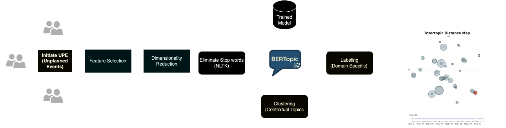

**Location:**  Oceanside, California
### Data Analyst & Strategy Deployment Intern

In my role, I worked closely with the Chief of Staff to drive strategic initiatives and optimize business processes. I identified use cases for RPA and supported resource management enhancements. This included creating interactive Tableau reports and assisting in the digitalization of huddle cascading and strategy deployment to enhance stakeholder connections.
  
**Key Accomplishments** 
1.  Enhanced Tableau dashboards for deviation management, resulting in a 73% reduction in machinery failures by assisting discrepancy owners in root cause analysis and corrective action planning.
    
2.  Utilized time series analysis to improve the efficiency of impacted processes by 47%, investigating breakdowns with trend analysis.
    
3.  Streamlined process orchestration and reduced manual data manipulation efforts by 25% through the development of ETL pipelines for the Intelligent Authoring tool.
    
4.  Led the digitalization of business processes and strategy deployment, resulting in a 65% increase in operational excellence and stakeholder satisfaction by fostering effective connections between various levels.
    
5.  Designed an NLP-based solution using BERTopic to analyze upticks in UPEs, identifying cluster trends, deviation types, and root causes to enhance RCA robustness.
    
6.  Spearheaded the automation of data extraction from Tableau dashboards into Trello boards, achieving dynamic updates and reducing manual data validation efforts by 90%.
    
7.  Initiated and conducted experiments to fine-tune the Langchain LLM model for Roche Internal use cases, improving its summarization capabilities and response refinement by 45%.

 
 

---

###  Identify cluster trends, deviation types, and possible root causes to increase RCA Robustness: BERTopic for Topic modeling 

  

  

 Implemented an NLP solution using BERTopic to analyze and address an increase in Unplanned Events (UPEs) across various domains, including site operations, drug manufacturing, and biochemistry in upstream and downstream processes. The objective was to strengthen Root Cause Analysis (RCA) by identifying trends, deviation types, and root causes.

BERTopic allowed us to cluster UPE reports, revealing trends and highlighting clusters with frequent occurrences. We categorized different types of deviations within these clusters, gaining a deeper understanding of the issue's complexity.

Additionally, BERTopic helped us explore the root causes by examining keywords and contextual information within each cluster, aiding in RCA strategy development.

In summary, our NLP-based solution using BERTopic improved UPE analysis, enhancing RCA robustness and contributing to safer and more efficient operations in diverse domains

  

  

---

### Deviation Management: Tableau Dashboards

  

  

First I build co-occurence matrices of ingredients from Facebook posts from 2011 to 2015. Then, to identify interesting and rare ingredient combinations that occur more than by chance, I calculate Lift and PPMI metrics. Lastly, I plot time-series data of identified trends to validate my findings. Interesting food trends have emerged from this analysis.

 

 

---

## Projects: Data Science & Business Analytics

  

### Google Page KPI Analytics

  

  

The Google Site KPI Analysis Tableau Dashboard project aims to create an intuitive tool for monitoring website performance. By collecting data from Google Analytics and other sources, the Tableau dashboard will provide customizable, interactive views of key metrics. This project includes data cleansing, advanced analytics, and dynamic filtering to support data-driven decision-making. Ultimately, it empowers businesses to optimize their online presence and user experiences through a user-friendly, real-time dashboard.

 

 

  

---

### Google Site Marketing Visual Analytics

  

  

Monitor website performance using key performance indicators (KPIs) like global site visits from different regions, daily visits, page views per visitor, daily unique visitors, time on page per visitor, daily downloads, and goal conversion. This project will gather data from Google Analytics and other relevant sources and transform it into a user-friendly, real-time Tableau dashboard. The dashboard will provide customizable, interactive views of these crucial KPIs, enabling businesses to optimize their online presence and enhance user experiences through data-driven decision-making

 

 

  

---

### Predict Breast Cancer with RF, PCA and SVM using Python

  

  

In this project I am going to perform comprehensive EDA on the breast cancer dataset, then transform the data using Principal Components Analysis (PCA) and use Support Vector Machine (SVM) model to predict whether a patient has breast cancer.

 

 

  

---

### Business Analytics Conference 2018: How is NYC's Government Using Money?

  

  

In three-month research and a two-day hackathon, I led a team of four students to discover insights from 6 million records of NYC and Boston government spending data sets and won runner-up prize for the best research poster out of 18 participating colleges.

 

 

  

---

## Extra
 

Besides Data Science, I also have a great passion for photography and Outdoorsports. 

 

 

